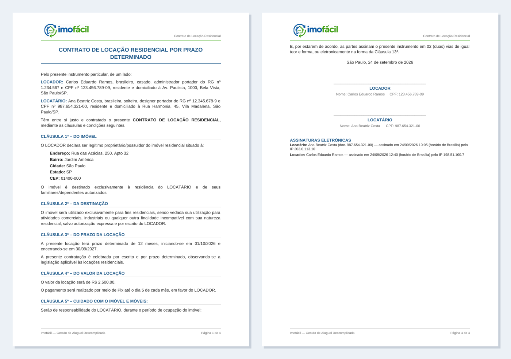
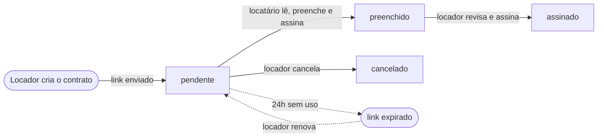

<p align="center">
  
</p>

<p align="center">
  <strong>Contratos de locação gerados, preenchidos e assinados online.</strong><br>
  O locador cria o contrato, envia um link e o locatário preenche e assina, sem precisar criar conta.
</p>

<p align="center">
  
  
  
  
  
</p>

<p align="center">
  <a href="#-início-rápido">Início rápido</a> •
  <a href="#-funcionalidades">Funcionalidades</a> •
  <a href="#-fluxo-de-um-contrato">Fluxo</a> •
  <a href="#-modelo-de-contrato">Modelo de contrato</a> •
  <a href="#%EF%B8%8F-operação">Operação</a> •
  <a href="#-estrutura-do-projeto">Estrutura</a>
</p>

---

## 📄 O contrato gerado

<p align="center">
  
</p>

<p align="center"><sub>Exemplo com dados fictícios: primeira página e página de assinaturas.</sub></p>

O locador e o locatário baixam o contrato em PDF. Ele tem a logo no cabeçalho,
a numeração de páginas no rodapé e, ao final, o registro das assinaturas
eletrônicas: nome, documento, data e hora (horário de Brasília) e IP.

## 🚀 Início rápido

### Com Docker (recomendado)

```bash
cp .env.example .env   # defina SECRET_KEY
docker compose up -d --build
```

A aplicação sobe em **http://localhost:5000**, servida pelo Gunicorn. A imagem
já inclui o LibreOffice Writer para gerar os PDFs, o que a deixa cerca de
400 MB maior. Os volumes `./instance`, `./contratos/gerados` e `./backups`
guardam o banco, os contratos e os backups entre reinícios.

### Localmente

```bash
python3 -m venv .venv
source .venv/bin/activate
pip install -r requirements.txt

cp .env.example .env   # defina SECRET_KEY (a aplicação não sobe sem ela)
flask run
```

> [!NOTE]
> O download em PDF precisa do LibreOffice (comando `soffice` no PATH). No
> Debian/Ubuntu: `sudo apt install libreoffice-writer fonts-liberation`. Sem
> ele o resto da aplicação funciona, mas o download mostra uma mensagem de erro.

### Contas iniciais

No primeiro start o banco é criado em `instance/app.db` e duas contas são semeadas:

| Usuário   | Senha        | Papel   |
|-----------|--------------|---------|
| `admin`   | `admin123`   | admin   |
| `locador` | `locador123` | locador |

> [!WARNING]
> Troque essas senhas (ou crie novas contas de locador pelo painel
> administrativo) antes de qualquer uso real.

## 👥 Papéis

| | Papel | O que faz |
|---|---|---|
| 🏠 | **Locador** | Completa o perfil no primeiro acesso (os dados entram na qualificação do LOCADOR). Depois cadastra imóveis, cria contratos com os termos (duração, datas, valor, forma de pagamento), acompanha o status, assina os contratos preenchidos e vê a ocupação no calendário. |
| 🛡️ | **Administrador** | Não cadastra imóveis. Cria contas de locador, ativa e desativa o acesso, redefine senhas e audita tentativas de login malsucedidas. |
| ✍️ | **Locatário** | Não faz login. Recebe um link exclusivo do contrato, lê o texto, preenche os dados e assina eletronicamente. O link expira em 24h e o locador pode renová-lo. |

## ✨ Funcionalidades

### Contratos
- **Link único por contrato**, com expiração de 24h. O link só pode ser renovado enquanto o contrato está `pendente`; um link usado, assinado ou cancelado não é reaberto.
- **Leitura antes de assinar**: o locatário vê um resumo em linguagem simples e o contrato completo, com os dados dele aparecendo no texto enquanto digita. O aceite só é liberado depois de rolar até o fim.
- **Assinatura eletrônica em duas etapas**: o locatário assina ao enviar os dados e o locador revisa e assina depois. Cada assinatura registra nome, documento, IP, user-agent e o hash SHA-256 do `.docx`.
- **Download em PDF** para locador e locatário. O locatário tem até 7 dias após a última assinatura, já que o arquivo tem CPF, RG e endereço; o locador baixa pelo painel a qualquer momento.
- **Verificação de integridade**: ao assinar, o locador grava o hash do arquivo final (`hash_final`), e a tela do contrato avisa se o arquivo em disco foi modificado.
- **Gravação atômica**: o arquivo só substitui o definitivo depois que o banco confirmou, então uma falha no meio não deixa contrato sem arquivo nem arquivo sem registro.
- **Lista de contratos** com filtros por situação ("Falta sua assinatura", "Com o locatário", "Assinados"…) e a ação principal de cada contrato em destaque.

### Imóveis e calendário
- Cadastro, edição e exclusão de imóveis, com validação de UF e CEP. A exclusão é bloqueada se o imóvel já tiver contratos.
- **Calendário de ocupação**: os dias ocupados aparecem em vermelho e os que aguardam a assinatura do locador em amarelo. Ao clicar num dia, aparecem os contratos daquela data.
- O valor do aluguel é guardado como número: `1500`, `1.500` ou `R$ 1.500,00` viram sempre `R$ 1.500,00`.

### Contas e segurança
- **Perfil do locador** com CPF, RG e telefone formatados automaticamente e validados no servidor (dígitos verificadores do CPF, DDD, email).
- **Senhas temporárias**: contas criadas ou senhas redefinidas pelo admin exigem a troca de senha no próximo login.
- **Rate limiting no login**: 5 tentativas falhas por usuário ou 10 por IP em 15 minutos, com auditoria das tentativas malsucedidas.
- Cookies de sessão `HttpOnly` e `SameSite=Lax`, além de `Secure` com `COOKIE_SECURE=1`. A `SECRET_KEY` é obrigatória e as chaves de exemplo são recusadas.
- Desativar um locador invalida a sessão dele na hora.

### Experiência de uso
- Modal de confirmação antes de ações destrutivas e mensagens de retorno depois de cada ação.
- Layout responsivo, com login e calendário pensados para o celular.
- Datas gravadas em UTC e exibidas no horário de Brasília.
- **Logs** em `instance/imofacil.log` (rotativo, 5 × 1 MB) e no stdout.

## 🔄 Fluxo de um contrato



1. O locador, com o perfil completo, cadastra o imóvel e cria o contrato. Recebe um link único (`/contrato/<token>`) e o contrato nasce `pendente`.
2. O locatário abre o link, lê o resumo e o contrato, preenche os dados e aceita os termos. Isso registra a assinatura dele, gera o `.docx` e o contrato passa a `preenchido`.
3. O locador revisa e assina em `/contratos/<id>/assinar`. O contrato passa a `assinado` e o bloco de assinaturas é anexado ao arquivo final.
4. O período aparece no calendário: em amarelo enquanto `preenchido` e em vermelho depois de `assinado`.

## 📝 Modelo de contrato

O texto fica em `contratos/Contrato_de_Locacao_Residencial.docx`. Para alterar
cláusulas, edite esse arquivo no Word ou no LibreOffice. A prévia mostrada ao
locatário e o contrato gerado vêm dele.

O modelo segue a identidade visual: logo no cabeçalho, "Página X de Y" no
rodapé, títulos em azul `#1E598A` e texto em Arial 10,5. A formatação é
mantida na geração (negrito e cores aplicados no Word aparecem no contrato
final). O bloco "Assinaturas eletrônicas" é acrescentado pelo app
(`anexar_bloco_assinaturas`) no mesmo estilo.

> [!IMPORTANT]
> O `.docx` é o documento oficial: os hashes das assinaturas se referem a ele.
> O PDF é uma cópia em cache (`contratos/gerados/<token>.pdf`), refeita sempre
> que o `.docx` muda. A primeira conversão de cada contrato leva alguns
> segundos; as seguintes são imediatas.

### Placeholders

Os campos `{{campo}}` são substituídos na geração (o mapa fica em `FIELD_MAP`, no `app.py`):

| Origem    | Placeholders |
|-----------|--------------|
| Locador   | `nome_locador`, `rg_locador`, `cpf_locador`, `email_locador`, `telefone_locador`, `endereço_locador`, `nacionalidade_locador`, `estado_locador`, `profissão_locador` |
| Locatário | `nome_locatario`, `rg_locatario`, `cpf_locatario`, `email_locatario`, `telefone_locatario`, `endereço_locatario`, `nacionalidade_locatario`, `estado_locatario`, `profissão_locatario` |
| Imóvel    | `endereco_imovel`, `bairro_imovel`, `cidade_imovel`, `estado_imovel`, `cep_imovel` |
| Termos    | `duracao_contrato`, `data_inicio`, `data_termino`, `valor`, `forma_pagamento` |
| Data      | `dia_assinatura`, `mes` (por extenso), `ano`, que são a data em que o locatário preenche |

- `valor` sai sempre formatado como `R$ 1.800,00`, então não escreva "R$" antes do placeholder.
- O foro e a cidade da assinatura usam a cidade e a UF do imóvel.
- O resumo "Você se compromete a", em `templates/cliente.html`, resume cláusulas fixas do modelo. Se elas mudarem, atualize o resumo também.
- A Cláusula 13ª descreve a assinatura eletrônica feita pela plataforma (nome, documento, IP, data/hora e hash SHA-256).
- Placeholders sem mapeamento aparecem crus (`{{...}}`) na prévia e no `.docx`. Ao criar um novo, adicione-o ao `FIELD_MAP` e ao `dados_contrato`.

## ⚙️ Operação

### Variáveis de ambiente

As variáveis são lidas do ambiente ou do arquivo `.env` (veja `.env.example`).

| Variável        | Descrição                                                            | Padrão |
|-----------------|----------------------------------------------------------------------|--------|
| `SECRET_KEY`    | Chave de sessão do Flask. **Obrigatória**: sem ela a aplicação não sobe | —      |
| `COOKIE_SECURE` | `1` para enviar cookies só via HTTPS (use em produção com HTTPS)     | `0`    |
| `BACKUP_MANTER` | Quantos backups o `flask backup` mantém                              | `14`   |
| `FLASK_DEBUG`   | `1` ativa o modo debug no `python app.py` (nunca em produção)         | `0`    |

### Banco de dados e migrações

A cada start, a aplicação aplica as migrações pendentes (`migrations/`).
Atualizar o código **não apaga** usuários, imóveis nem contratos. Bancos
criados antes das migrações são reconhecidos e marcados na revisão inicial
automaticamente.

Ao mudar um modelo em `models.py`, gere a migração e revise o arquivo criado
em `migrations/versions/` antes de commitar:

```bash
flask db migrate -m "descrição da mudança"
flask db upgrade
```

### Backup

```bash
flask backup                              # local
docker compose exec web flask backup      # no Docker
```

O comando cria `backups/<data-hora>/` com uma cópia consistente do banco (feita
pela API de backup do SQLite, segura com a aplicação no ar) e um `.zip` dos
contratos gerados. Mantém os `BACKUP_MANTER` backups mais recentes. Para rodar todo dia, agende no cron:

```
0 3 * * * cd /caminho/do/projeto && docker compose exec -T web flask backup
```

**Para restaurar:** pare a aplicação, copie o `app.db` do backup para
`instance/` e extraia o `.zip` em `contratos/gerados/`.

### Esqueci a senha

- **Locador**: o admin clica em "Redefinir senha" no painel. Uma senha temporária aparece uma única vez na tela, para ser repassada.
- **Admin**: pelo terminal do servidor, com `flask redefinir-senha admin` (ou `docker compose exec web flask redefinir-senha admin`).

## 🧱 Stack

| Camada        | Tecnologia |
|---------------|------------|
| Backend       | Python 3.11, Flask, Flask-Login |
| Banco         | SQLite (`instance/app.db`), Flask-SQLAlchemy, Flask-Migrate/Alembic |
| Documentos    | `python-docx` para gerar os contratos e LibreOffice headless para convertê-los em PDF |
| Servidor      | Gunicorn, Docker Compose |

## 📁 Estrutura do projeto

```
app.py                  # rotas, regras de negócio e comandos (backup, redefinir-senha)
models.py               # modelos SQLAlchemy (Locador, Imovel, Contrato, Assinatura, LoginAttempt)
validacao.py            # validação de CPF, RG, telefone, email, CEP, UF e valor
migrations/             # migrações do banco (Flask-Migrate/Alembic)
templates/              # páginas Jinja
static/                 # CSS, JS e imagens (logo em static/assets/)
docs/                   # imagens usadas neste README
contratos/
  Contrato_de_Locacao_Residencial.docx   # modelo usado na geração e na prévia
  Contrato_Gerado.docx                   # exemplo antigo de contrato gerado (não usado pelo app)
  gerados/                               # contratos gerados e PDFs em cache (não versionado)
instance/               # banco SQLite e log (não versionado)
backups/                # backups do "flask backup" (não versionado)
```

---

<p align="center">
  <sub>Imofácil: gestão de aluguel descomplicada.</sub>
</p>
